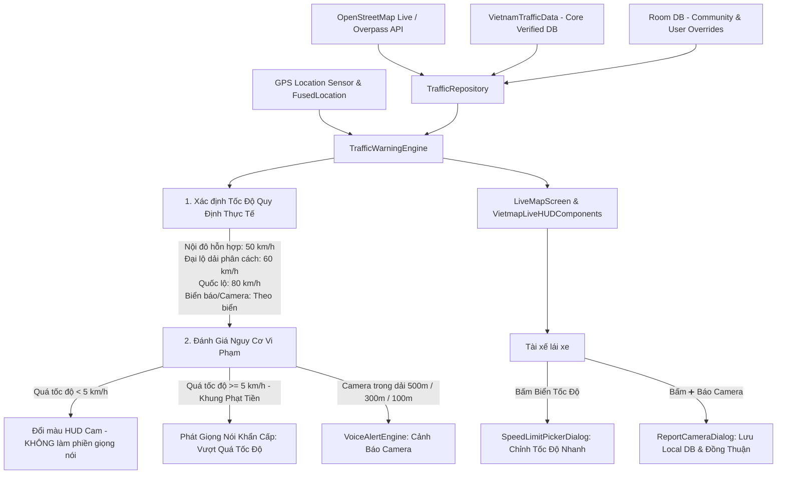

# 🗺️ BẢN ĐỒ KIẾN TRÚC & LỘ TRÌNH DỰ ÁN (PROJECT ROADMAP & ARCHITECTURE)
> **Ứng Dụng Cảnh Báo Giao Thông & Tốc Độ Chuẩn Việt Nam (VNGPS Speed Alert)**  
> *Tài liệu định hướng kiến trúc chuẩn xác dành cho AI và Lập trình viên tra cứu tức thì.*

---

## 📌 1. TỔNG QUAN DỰ ÁN & PHƯƠNG ÁN CHUẨN DỮ LIỆU NHƯ VIETMAP

- **Mục tiêu**: Cung cấp hệ thống bản đồ dẫn đường và cảnh báo giao thông thời gian thực **chính xác tuyệt đối từng mét** trên toàn lãnh thổ Việt Nam theo chuẩn Vietmap Live.
- **Bí quyết Vietmap**: Vietmap không cần đi đo từng mét đường bằng xe, mà áp dụng **Quy chuẩn GIS Phân đoạn (Road Segment Engine)** kết hợp **Dữ liệu số hóa chính thức từ Cục CSGT & Sở GTVT 63 tỉnh thành**:
  1. **Số hóa điểm Camera CSGT**: Khai thác dữ liệu hệ thống camera giám sát, đo tốc độ tự động trên các tuyến cao tốc, quốc lộ và các nút giao nội đô lớn do Cục CSGT / Sở GTVT công bố.
  2. **Thuật toán Map-Matching theo Đoạn đường (Road Segments)**: Phân chia mạng lưới đường theo thuộc tính Thông tư 31/2019/TT-BGTVT (Khu dân cư vs Ngoài khu dân cư, Đường có dải phân cách cứng vs Đường hỗn hợp) ➔ Tự động gán 50 km/h cho nội đô và 60/80 km/h cho trục chính.
  3. **Tự động Cập nhật Đám mây (Cloud OTA Auto-Sync)**: App tự động tải gói dữ liệu camera/biển báo mới nhất (~1-2MB) định kỳ, người dùng không cần báo cáo thủ công, giữ giao diện lái xe tinh gọn 100%.
- **Nền tảng**: Android Native (Kotlin, Jetpack Compose, Material 3, Coroutines Flow, Room Database).
- **Bản đồ**: Google Maps Retina HD 512px @2x (Siêu nét, không vỡ hạt).

---

## 📂 2. BẢNG TRA CỨU FILE NHANH DÀNH CHO AI (QUICK FILE REFERENCE)

Khi cần phát triển hoặc sửa lỗi một tính năng, **tra cứu ngay file phụ trách theo bảng dưới đây**:

| Tính năng / Phân hệ | File mã nguồn chính | Mục đích & Trách nhiệm |
| :--- | :--- | :--- |
| **Bản đồ hiển thị & Vẽ Canvas** | [`OfflineMapCanvas.kt`](file:///e:/code/xe/app/src/main/java/com/example/ui/components/OfflineMapCanvas.kt) | Render tile map, icon xe 3D, marker camera, vạch dẫn đường, hit-testing chạm màn hình |
| **Quản lý Nguồn Tile & Cache Bản đồ** | [`OsmTileManager.kt`](file:///e:/code/xe/app/src/main/java/com/example/service/OsmTileManager.kt) | Tải tile Google Maps HD @2x, Carto, cache tile disk Room, quản lý offline pack |
| **Luật Tốc Độ & Đánh Giá Cảnh Báo** | [`TrafficWarningEngine.kt`](file:///e:/code/xe/app/src/main/java/com/example/service/TrafficWarningEngine.kt) | Tính toán tốc độ luật định (50/60/80), quét camera theo hành lang đường, ngưỡng phạt NĐ 100/123 |
| **Dữ Liệu Tốc Độ Dự Phòng & Tên Đường** | [`MockSpeedLimitDataSource.kt`](file:///e:/code/xe/app/src/main/java/com/example/data/datasource/MockSpeedLimitDataSource.kt) | Từ điển tên đường TP.HCM/HN (50 km/h nội đô, 60 km/h đại lộ, 80 km/h quốc lộ) |
| **Cơ Sở Dữ Liệu Camera & POI Toàn Quốc** | [`VietnamTrafficData.kt`](file:///e:/code/xe/app/src/main/java/com/example/data/VietnamTrafficData.kt) | Hàng trăm điểm camera xác thực, tọa độ ngã tư, mức phạt tiền, danh sách cây xăng/ATM |
| **Giọng Nói & Âm Thanh Cảnh Báo** | [`VoiceAlertEngine.kt`](file:///e:/code/xe/app/src/main/java/com/example/service/VoiceAlertEngine.kt) | Xử lý Android TTS (Text-To-Speech) tiếng Việt, phát âm dứt khoát không ngắt quãng |
| **Dẫn Đường & Tính Lộ Trình (Routing)** | [`NavigationRoutingService.kt`](file:///e:/code/xe/app/src/main/java/com/example/service/NavigationRoutingService.kt) | Thuật toán A* Routing, tìm kiếm địa chỉ OSRM / Geocoding, gợi ý 2-3 tuyến đường thay thế |
| **Màn Hình Lái Xe Chính (HUD & Map)** | [`LiveMapScreen.kt`](file:///e:/code/xe/app/src/main/java/com/example/ui/screens/LiveMapScreen.kt) | Giao diện buồng lái, thanh tìm kiếm tiện ích, nút báo nhanh 1 chạm, chọn lộ trình |
| **Cụm Đồng Hồ Tốc Độ & Biển Báo (HUD)** | [`VietmapLiveHUDComponents.kt`](file:///e:/code/xe/app/src/main/java/com/example/ui/components/VietmapLiveHUDComponents.kt) | Đồng hồ tốc độ tròn, biển báo 50/60 km/h, danh sách camera sắp tới bên trái |
| **Chi Tiết Camera & Mức Phạt** | [`CameraDetailBottomSheet.kt`](file:///e:/code/xe/app/src/main/java/com/example/ui/components/CameraDetailBottomSheet.kt) | Bottom sheet hiện thông tin phạt nguội NĐ 100/123, nút nghe thử giọng nói, chỉ đường |
| **Hộp Thoại Báo Camera 1 Chạm** | [`ReportCameraDialog.kt`](file:///e:/code/xe/app/src/main/java/com/example/ui/screens/ReportCameraDialog.kt) | Cho phép tài xế báo chốt CSGT, camera mới, biển báo tốc độ thực tế |
| **Cài Đặt & Tùy Biến Ứng Dụng** | [`SettingsScreen.kt`](file:///e:/code/xe/app/src/main/java/com/example/ui/screens/SettingsScreen.kt) | Kích thước icon xe (0.9x - 2.2x), chế độ xe máy/ô tô, khoảng cách cảnh báo, nguồn bản đồ |
| **Mô Hình Dữ Liệu (Data Models)** | [`TrafficModels.kt`](file:///e:/code/xe/app/src/main/java/com/example/data/model/TrafficModels.kt) | Định nghĩa `TrafficCamera`, `CameraType`, `ActiveWarning`, `DestinationPlace` |
| **Cơ Sở Dữ Liệu Cục Bộ (Room DB)** | [`TrafficEntities.kt`](file:///e:/code/xe/app/src/main/java/com/example/data/local/TrafficEntities.kt) & [`TrafficDao.kt`](file:///e:/code/xe/app/src/main/java/com/example/data/local/TrafficDao.kt) | Bảng Room lưu chuyến đi, camera đóng góp, địa điểm yêu thích, cài đặt người dùng |
| **Quản Lý Trạng Thái Toàn Cục** | [`SpeedAlertViewModel.kt`](file:///e:/code/xe/app/src/main/java/com/example/viewmodel/SpeedAlertViewModel.kt) | Kết nối GPS, cảm biến la bàn, lưu DB, đồng bộ camera trực tuyến Overpass |

---

## ⚙️ 3. LUỒNG DỮ LIỆU & NGUYÊN LÝ HOẠT ĐỘNG (CORE ARCHITECTURE)

---

## ⚖️ 4. QUY CHUẨN PHÁP LÝ TÍCH HỢP (LEGAL STANDARDS)

1. **Thông tư 31/2019/TT-BGTVT**:
   - Đường đô thị không dải phân cách giữa / đường hỗn hợp: **Tối đa 50 km/h** (Lũy Bán Bích, Thoại Ngọc Hầu, Hòa Bình, CMT8, Quang Trung, Hoàng Văn Thụ, Ba Tháng Hai...).
   - Đường đô thị đôi có dải phân cách cứng: **Tối đa 60 km/h** (Phạm Văn Đồng, Võ Văn Kiệt, Mai Chí Thọ, Nguyễn Văn Linh).
   - Đường ngoài khu dân cư / Quốc lộ: **Tối đa 80 km/h** (QL1A, QL22, QL13...).
   - Đường cao tốc: **100 - 120 km/h** (Kèm cảnh báo CẤM XE MÁY).

2. **Nghị định 100/2019/NĐ-CP & Nghị định 123/2021/NĐ-CP**:
   - Vượt quá từ 1 - 4.9 km/h: Mức nhắc nhở, không phạt tiền ➔ HUD cảnh báo màu cam nhẹ, không phát âm thanh lặp lại gây phiền.
   - Vượt quá $\ge 5$ km/h: Bắt đầu bị phạt tiền (300k - 1tr đối với xe máy, 800k - 12tr đối với ô tô) ➔ Kích hoạt giọng nói dứt khoát bảo vệ người dùng không bị phạt.

---

## 🚀 5. TRẠNG THÁI TÍNH NĂNG ĐÃ HOÀN THIỆN (COMPLETED FEATURES)

- [x] **Bản đồ Retina HD 512px @2x**: Tích hợp Google Maps HD siêu nét, chữ tên đường không bị vỡ trên màn hình 2K/120Hz (Galaxy S24+).
- [x] **Biểu tượng xe 3D Chevron & Kích thước tùy biến**: 5 nấc điều chỉnh tỉ lệ icon xe (0.9x đến 2.2x Max).
- [x] **Chuẩn hóa tốc độ thực tế 50 km/h nội đô**: Toàn bộ các tuyến đường nội thành TP.HCM tuân thủ đúng 50 km/h.
- [x] **Mở rộng cơ sở dữ liệu Camera phạt nguội**: Hàng trăm điểm camera xác thực tại TP.HCM (Tân Phú, Tân Bình, Q1-12, Gò Vấp, Bình Thạnh...) và toàn quốc.
- [x] **Báo Camera 1 chạm (`➕ 📸`)**: Nút nổi trực quan trên màn hình lái xe để báo chốt CSGT, camera mới.
- [x] **Tra cứu chi tiết Camera & Khung phạt**: Chạm vào marker camera để xem địa chỉ, khoảng cách, mức phạt theo Nghị định 100/123/NĐ-CP và nghe thử giọng nói.
- [x] **Chỉnh sửa / Tra cứu tốc độ tuyến đường 1 chạm**: Bấm vào biển báo tốc độ trên HUD để chọn nhanh hoặc xem lý do pháp lý.
- [x] **Thanh tiện ích 1 chạm**: Cây xăng ⛽, Ngân hàng 🏦, Sửa xe 🔧, Cứu hộ 🏥, Ăn uống ☕, Bãi đỗ 🅿️, Địa điểm Yêu thích ⭐.

---

## 🔮 6. LỘ TRÌNH PHÁT TRIỂN TIẾP THEO (FUTURE ROADMAP)

### 📍 Giai Đoạn 2: Tối Ưu Lộ Trình & Tránh Kẹt Xe Thời Gian Thực (Smart Traffic Routing)
- [ ] **Mật độ giao thông thời gian thực (Traffic Congestion Heatmap)**: Vẽ màu đỏ/vàng/xanh theo thời gian thực trên các cung đường kẹt xe.
- [ ] **Tự động định tuyến lại khi lỡ ngã rẽ (Instant Auto-Reroute)**: Thuật toán tính toán lại lộ trình chỉ trong < 1.2 giây khi tài xế đi lệch đường.

### 📍 Giai Đoạn 3: Chiếu Kính Lái Ban Đêm (HUD Windshield Reflection Mode)
- [ ] **HUD Lật Ngược Màn Hình (Mirror Mode)**: Đặt điện thoại lên mặt táp-lô ban đêm để chiếu ngược đồng hồ tốc độ và biển báo lên kính lái ô tô.

### 📍 Giai Đoạn 4: Trí Tuệ Nhân Tạo Nhận Diện Biển Báo Qua Camera Hành Trình (AI Dashcam Sign Detector)
- [ ] **CameraX + Google ML Kit On-Device**: Nhận diện trực tiếp biển báo giới hạn tốc độ và biển báo khu dân cư thực tế khi gắn điện thoại trên giá đỡ xe.

---
*Tài liệu này được duy trì tự động nhằm đảm bảo mọi cập nhật trong dự án luôn đồng bộ và nhất quán.*
